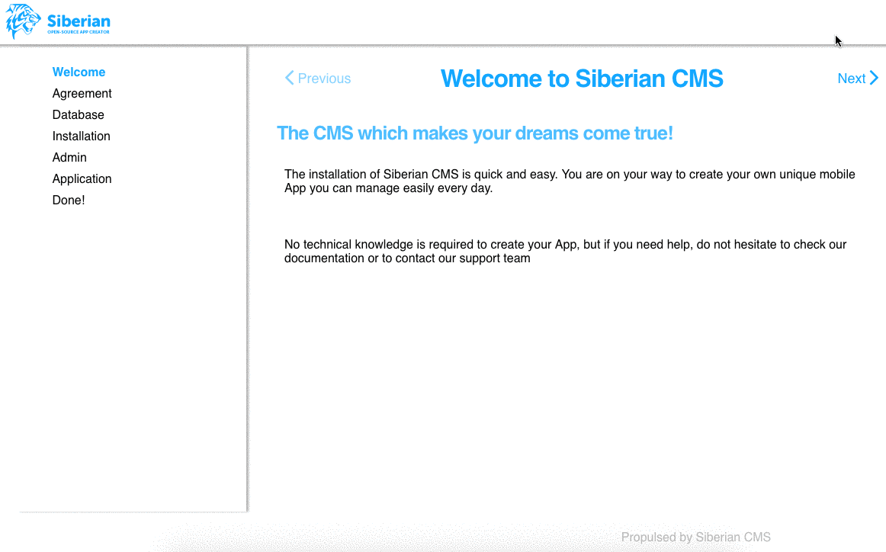

#  We moved the main Siberian repository here [https://github.com/Xtraball/Siberian](https://github.com/Xtraball/Siberian) With more development tools & features.

---


Your are reading the old Siberian README.md, please note this repository has ended on update 4.12.18.

# SiberianCMS: SAE Single App Edition

[Public Roadmap](http://board.siberiancms.com/b/7AYdMDEpFcmt3eZtb/siberiancms-public-roadmap)


## Documentation

* [User documentation](http://doc.siberiancms.com)
* [Developer documentation](http://developer.siberiancms.com)

## Installation

### Configuration

1. First you will need to either checkout the project `git clone https://github.com/Xtraball/SiberianCMS.git`

    or download the [zip archive](https://github.com/Xtraball/SiberianCMS/archive/master.zip) then extract it on your webserver.

2. Setup your empty database and user

3. Configure your environment with [apache](#apache) or [nginx](#nginx)

#### Apache

If you are running under Apache, be sure that the directive `AllowOverride all` is working, unless the `.htaccess` configuration will fail.

```
<VirtualHost [IP]:80>
        ServerName [yourdomain.tld]

		CustomLog [/path/to/siberiancms]/var/log/httpd.access_log combined
		ErrorLog [/path/to/siberiancms]/var/log/httpd.error_log

		DirectoryIndex index.php

        DocumentRoot [/path/to/siberiancms]

        <Directory [/path/to/siberiancms]>
                Options Indexes FollowSymLinks
                AllowOverride all
        </Directory>

</VirtualHost>
```


#### Nginx

If you are running under Nginx, all you need is in the current configuration, 
please check the `fastcgi` options as they may vary depending on your installation

```
server {
    listen [::]:80;

	root [/path/to/siberiancms];
		
	access_log [/path/to/siberiancms]/var/log/nginx.access_log;
	error_log [/path/to/siberiancms]/var/log/nginx.error_log;

	index index.php index.html index.htm;

	server_name [yourdomain.tld];
	
	location ~ ^/app/configs {
        deny all;
    }
    
    location ~ ^/var/apps/certificates {
        deny all;
    }
    
    # Let's Encrypt configuration
    location = /.well-known/check {
        default_type "text/plain";
        try_files $uri =404;
    }
    
    location ^~ /.well-known/acme-challenge/ {
        default_type "text/plain";
        try_files $uri =404;
    }

	location / {
		try_files $uri /index.php?$query_string;
	}

	location ~ \.php$ {
		fastcgi_index index.php;
		fastcgi_pass 127.0.0.1:9000;
		fastcgi_param SCRIPT_FILENAME $document_root$fastcgi_script_name;
		include fastcgi_params;
		fastcgi_buffers 256 128k;
		fastcgi_connect_timeout 300s;
		fastcgi_send_timeout 300s;
		fastcgi_read_timeout 300s;
	}

    location ~* ^.+.(js|css|png|jpg|jpeg|gif|ico|html)$ {
		access_log        off;
		log_not_found     off;
		expires           0;
	}
	
	location ~ /\. {
		access_log off;
		log_not_found off;
		deny all;
	}

	gzip on;
	gzip_min_length  1000;
	gzip_proxied any;
	gzip_types text/plain application/xml text/css text/js application/x-javascript;
	
	client_max_body_size 256M;

}
```

When you're done with the previous steps, reload your web server.


### Web installer

* Go to `http://yourdomain.tld` then follow the instructions

